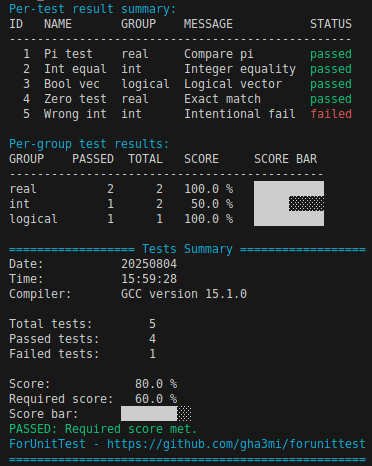

[](https://github.com/gha3mi/forunittest)
[](https://github.com/gha3mi/forunittest/releases)
[](https://gha3mi.github.io/forunittest/)
[](https://github.com/gha3mi/forunittest/actions/workflows/CI-CD.yml)
[](https://github.com/gha3mi/forunittest/blob/main/LICENSE)

<!--  -->

**ForUnitTest**: A Fortran library for unit testing.

## Usage

```fortran
use forunittest, only: unit_tests

type(unit_tests) :: tests

! Initialize the test suite with 'n' test cases
call tests%initialize(n)

! Run test number i
call tests%test(i)%check(&
   name     = "Test name",         & ! unique name shown in report
   res      = result_value,        & ! Actual result (real, int, logical, complex)
   expected = expected_value,      & ! Expected value (same type/shape as res)
   tol      = 1e-6_rk,             & ! Optional: tolerance for real/complex comparisons
   msg      = "Short description", & ! shown in summary
   group    = "Group name")          ! used in grouped summaries

! Print test summary
call tests%summary(&
   required_score = 80.0_rk, & ! Required % of passing tests
   verbose        = 3,       & ! 0: none, 1: group only, 2: test only, 3: both
   stop_fail      = .true.)    ! Stop program if score is below required
```

## fpm dependency

To use `ForUnitTest` as a dependency in your fpm project, include the following line in your `fpm.toml` file:

```toml
[dependencies]
forunittest = {git="https://github.com/gha3mi/forunittest.git"}
```

## How to Run the Demo

**Clone the repository:**

Clone the `ForUnitTest` repository from GitHub using:

```shell
git clone https://github.com/gha3mi/forunittest.git
cd forunittest
```

**Run the demo:**

```shell
fpm run --example demo
```

### Demo Output



## Status

<!-- STATUS:setup-fortran-conda:START -->
| Compiler   | macos | ubuntu | windows |
|------------|----------------------|----------------------|----------------------|
| `flang-new` | - | fpm ✅  cmake ✅ | fpm ✅  cmake ✅ |
| `gfortran` | fpm ✅  cmake ✅ | fpm ✅  cmake ✅ | fpm ✅  cmake ✅ |
| `ifx` | - | fpm ✅  cmake ✅ | fpm ✅  cmake ✅ |
| `lfortran` | fpm ❌  cmake ❌ | fpm ❌  cmake ❌ | fpm ❌  cmake ❌ |
| `nvfortran` | - | fpm ✅  cmake ✅ | - |
<!-- STATUS:setup-fortran-conda:END -->

## API documentation

The most up-to-date API documentation for the main branch is available
[here](https://gha3mi.github.io/forunittest/).
To generate the API documentation for `ForUnitTest` using
[ford](https://github.com/Fortran-FOSS-Programmers/ford) run the following
command:

```shell
ford README.md
```

## Contributing

Contributions to `ForUnitTest` are welcome!
If you find any issues or would like to suggest improvements, please open an issue.
